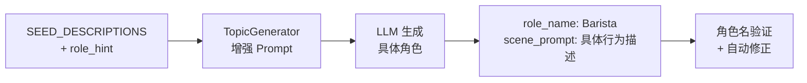

# TopicGenerator 角色生成增强方案

**版本**：v1.3
**日期**：2026-05-13
**状态**：待实施
**评审人**：Claude（资深架构师评审版）

---

## 🔴 评审意见（v1.2 待确认）

### Bug 1：禁止词匹配误伤 "Shop Assistant"

**问题位置**：`_FORBIDDEN_ROLE_KEYWORDS` 包含 `"assistant"`

```python
_FORBIDDEN_ROLE_KEYWORDS = {
    "english coach", "language tutor", "teacher", "instructor",
    "assistant",  # ← 问题：会误伤 "Shop Assistant", "Teaching Assistant"
    "coach", "tutor", "trainer", "language coach"
}
```

**触发条件**：`role_name = "Shop Assistant"` → `"assistant" in "shop assistant"` → True → 被替换

**修复方案**：改用更精确的短语匹配：

```python
_FORBIDDEN_ROLE_KEYWORDS = {
    "english coach", "language tutor", "language assistant",
    "teacher", "instructor", "personal assistant",
    "teaching assistant", "coach", "tutor", "trainer", "language coach"
}
```

**移除**：`"assistant"` 单字匹配

---

### 🟡 改进建议

| # | 建议 | 状态 |
|---|------|------|
| 1 | 测试用例增加：`assert _validate_and_fix_role_name('Shop Assistant', 'clothes shopping') == 'Shop Assistant'` | 待补充 |
| 2 | 关键词 `["shop"]` 应能匹配 "clothes shopping" | ✅ 确认正确（substr 匹配） |

---

## 1. 背景与问题

### 1.1 问题描述

当前 `TopicGenerator` 生成的话题数据中，`role_name` 字段经常出现通用角色名称（如 "English Coach"、"Language Tutor"、"Teacher"），而非具体场景中的真实人物角色。

**示例问题**：

| 期望输出 | 当前可能输出 |
|---------|-------------|
| "Barista" | "English Coach" |
| "Hotel Receptionist" | "Language Tutor" |
| "Doctor" | "Teacher" |

### 1.2 影响

当用户开始对话时，AI 的开场提示为：

```
"You are acting as: English Coach in a Ordering drinks and food at a coffee shop setting."
```

这导致用户体验不佳：
- **角色代入感弱**：用户期望与具体角色（如咖啡师）互动，而非与"教练"对话
- **场景真实性差**：不符合产品"沉浸式真实场景练习"的定位
- **学习效果打折**：真实角色更有利于语言学习的语境构建

### 1.3 根本原因

1. **Prompt 约束不足**：LLM 生成时没有明确要求生成具体角色
2. **缺少验证机制**：生成结果没有后置校验

---

## 2. 方案设计

### 2.1 设计原则

- **可扩展性**：通过扩展数据结构支持未来更多场景
- **最小侵入**：尽量复用现有代码结构
- **向后兼容**：不影响现有话题和对话流程

### 2.2 架构改动



---

## 3. 具体改动

### 3.1 文件一：`python_backend/scripts/seed_topics.py`

**改动类型**：数据结构扩展

**当前代码**：
```python
SEED_DESCRIPTIONS = [
    {"domain": "餐饮", "desc": "Ordering drinks and food at a coffee shop or café"},
    {"domain": "出行", "desc": "Taking a taxi or rideshare like Uber — giving directions and making small talk"},
    # ...
]
```

**改动后**：
```python
SEED_DESCRIPTIONS = [
    {
        "domain": "餐饮",
        "desc": "Ordering drinks and food at a coffee shop or café",
        "role_hint": "Barista",  # 新增：建议的角色类型
    },
    {
        "domain": "出行",
        "desc": "Taking a taxi or rideshare like Uber — giving directions and making small talk",
        "role_hint": "Taxi Driver",
    },
    {
        "domain": "出行",
        "desc": "Checking in at a hotel, asking for amenities, and checking out",
        "role_hint": "Hotel Receptionist",
    },
    {
        "domain": "购物",
        "desc": "Shopping for clothes — asking for sizes, colors, and trying items on",
        "role_hint": "Shop Assistant",
    },
    {
        "domain": "购物",
        "desc": "Grocery shopping and asking store staff where to find items",
        "role_hint": "Store Clerk",
    },
    {
        "domain": "医疗",
        "desc": "Visiting a doctor, describing symptoms, and understanding a prescription",
        "role_hint": "Doctor",
    },
    {
        "domain": "职业",
        "desc": "Calling customer service to report a problem or request a refund",
        "role_hint": "Customer Service Agent",
    },
    {
        "domain": "职业",
        "desc": "A business meeting — presenting ideas, giving feedback, and discussing next steps",
        "role_hint": "Business Executive",
    },
    {
        "domain": "社交",
        "desc": "Making small talk at a party — introducing yourself and discussing hobbies",
        "role_hint": "Party Guest",
    },
    {
        "domain": "社交",
        "desc": "Renting an apartment — asking the landlord about rules, utilities, and repairs",
        "role_hint": "Landlord",
    },
    {
        "domain": "餐饮",
        "desc": "Sitting down at a restaurant, ordering from the menu, and paying the bill",
        "role_hint": "Waiter",
    },
    {
        "domain": "出行",
        "desc": "Checking in luggage and going through security at an airport",
        "role_hint": "Airport Staff",
    },
]
```

**改动说明**：
- `role_hint`：作为 LLM 的角色参考，强制 LLM 思考具体场景角色
- **移除 `scene_context`**：LLM 可从 description 推断场景，无需额外维护成本

---

### 3.2 文件二：`python_backend/infrastructure/topic_generator.py`

**改动类型**：Prompt 增强 + 角色验证

#### 3.2.1 函数签名更新

**当前**：
```python
async def get_or_generate_topic(
    description: str,
    openai_client,
    db: Optional[Session] = None,
    domain: Optional[str] = None,
) -> Topic:
```

**改动后**：
```python
async def get_or_generate_topic(
    description: str,
    openai_client,
    db: Optional[Session] = None,
    domain: Optional[str] = None,
    role_hint: Optional[str] = None,  # 新增
) -> Topic:
```

#### 3.2.2 Prompt 模板重写

**当前 prompt（_generate_from_scratch）**：
```python
prompt = f"""You are designing English language practice topics for a conversation coaching app.

TARGET TOPIC: "{description}"
...
"""
```

**改动后 prompt**：
```python
prompt = f"""You are designing English language practice topics for a conversation coaching app.

TARGET SCENARIO: "{description}"

CRITICAL ROLE REQUIREMENTS:
- role_name MUST be a SPECIFIC REAL-WORLD PERSON in this scenario (e.g., Barista, Taxi Driver, Hotel Receptionist, Doctor, Shop Assistant, Waiter)
- role_name MUST NOT be generic titles like: "English Coach", "Language Tutor", "Teacher", "Instructor", "Assistant", "Coach", "Trainer", "Tutor"
- scene_prompt (system prompt) should describe how this SPECIFIC ROLE speaks and behaves, NOT how a language coach teaches

{role_hint_block}

{_NODE_DISTRIBUTION_HINT}

Always include title_zh (natural Chinese for the same topic as title).

Return ONLY a JSON object matching this exact schema (no markdown, no explanation):
{_SCHEMA_STR}"""
```

**其中 `role_hint_block` 的拼接代码**：
```python
role_hint_block = (
    f'\nSUGGESTED ROLE: "{role_hint}" — use this as a reference, but feel free to adjust if a more specific role fits the scenario better.\n'
    if role_hint else ""
)
```

**参考引导生成 prompt（_generate_with_reference）** 也需同样增强：
```python
prompt = f"""You are designing English language practice topics for a conversation coaching app.

TARGET SCENARIO: "{description}"
{domain_hint}

CRITICAL ROLE REQUIREMENTS:
- role_name MUST be a SPECIFIC REAL-WORLD PERSON in this scenario (e.g., Barista, Taxi Driver, Hotel Receptionist, Doctor, Shop Assistant, Waiter)
- role_name MUST NOT be generic titles like: "English Coach", "Language Tutor", "Teacher", "Instructor", "Assistant", "Coach", "Trainer", "Tutor"
- scene_prompt should describe how this SPECIFIC ROLE speaks and behaves, NOT how a language coach teaches

{role_hint_block}

REFERENCE EXAMPLE (highest-quality similar topic from our library — use it as a structural template):
{ref_json}

Create a NEW topic for the target description by:
1. Keeping the SAME structural quality (depth of vocab_tags, node distribution, rule style)
2. Replacing ALL content with material appropriate for the new target topic
3. Maintaining the same learner_level unless the new topic clearly suits a different level

{_NODE_DISTRIBUTION_HINT}

Always include title_zh (natural Chinese for the same topic as title).

Return ONLY a JSON object matching this exact schema (no markdown, no explanation):
{_SCHEMA_STR}"""
```

#### 3.2.3 角色验证逻辑（新增）

**新增位置**：模块顶部常量区

```python
# ── 禁止的通用角色关键词（用于后置验证）───────────────────────────────────────
# 注意：使用完整短语匹配，避免误伤 "Shop Assistant", "Teaching Assistant" 等合法角色
_FORBIDDEN_ROLE_KEYWORDS = {
    "english coach", "language tutor", "language assistant",
    "teacher", "instructor", "personal assistant",
    "teaching assistant", "coach", "tutor", "trainer", "language coach"
}
```

**新增函数**：
```python
def _validate_and_fix_role_name(role_name: str, description: str, role_hint: str = None) -> str:
    """
    验证并修正 role_name。
    如果命中禁止关键词或为空，则使用兜底逻辑推断。
    """
    if not role_name:
        return _infer_role_from_description(description, role_hint)

    role_lower = role_name.lower().strip()

    # 检查是否命中禁止关键词
    for forbidden in _FORBIDDEN_ROLE_KEYWORDS:
        if forbidden in role_lower:
            logger.warning(f"[TopicGenerator] Invalid role_name '{role_name}', inferring from description")
            return _infer_role_from_description(description, role_hint)

    return role_name


def _infer_role_from_description(description: str, role_hint: str = None) -> str:
    """
    从场景描述推断具体角色。
    优先级：role_hint > 关键词映射 > 描述中的名词提取
    """
    # 如果有 role_hint，直接使用（它是人工指定的，最可靠）
    if role_hint:
        return role_hint

    # 简单的关键词映射表（按优先级排序）
    role_mappings = [
        # 餐饮
        (["coffee", "cafe", "café"], "Barista"),
        (["restaurant", "dinner", "lunch"], "Waiter"),
        (["bar", "pub"], "Bartender"),
        # 出行
        (["taxi", "cab"], "Taxi Driver"),
        (["uber", "rideshare", "lyft"], "Driver"),
        (["hotel", "check-in", "check-out", "accommodation"], "Hotel Receptionist"),
        (["airport", "flight", "boarding"], "Airport Staff"),
        (["train", "railway", "station"], "Train Conductor"),
        # 购物
        (["clothes", "clothing", "fashion", "shoes", "shopping"], "Shop Assistant"),
        (["grocery", "supermarket", "grocery store"], "Store Clerk"),
        (["mall", "department store"], "Sales Associate"),
        # 医疗
        (["doctor", "medical", "clinic", "hospital", "symptoms"], "Doctor"),
        (["pharmacy", "prescription", "medicine"], "Pharmacist"),
        # 职业
        (["customer service", "refund", "complaint", "support"], "Customer Service Agent"),
        (["business meeting", "executive", "corporate", "presentation"], "Business Executive"),
        (["interview", "job"], "Hiring Manager"),
        # 社交
        (["party", "gathering", "social event"], "Party Guest"),
        (["apartment", "rental", "landlord", "lease"], "Landlord"),
        (["neighbor", "neighbourhood"], "Neighbor"),
    ]

    desc_lower = description.lower()
    for keywords, role in role_mappings:
        for keyword in keywords:
            if keyword in desc_lower:
                return role

    # 最后兜底：返回通用服务人员（比 "English Coach" 具体）
    return "Service Provider"
```

#### 3.2.4 调用验证函数

**在 `_call_llm_and_save` 函数中**，解析 JSON 后、写入 DB 前调用验证：

```python
async def _call_llm_and_save(
    prompt: str,
    db: Session,
    openai_client,
    *,
    domain: Optional[str] = None,
    role_hint: Optional[str] = None,  # 新增
) -> Topic:
    # ... LLM 调用代码不变 ...

    raw = resp.choices[0].message.content
    data = _parse_and_validate(raw)
    await _fill_title_zh_if_missing(data, openai_client)

    # 新增：验证并修正 role_name
    data["role_name"] = _validate_and_fix_role_name(
        data.get("role_name", ""),
        data.get("title", ""),
        role_hint=role_hint,
    )

    return _save_to_db(data, db, domain=domain)
```

**同时需要更新内部调用链**：

```python
# _generate_from_scratch 中
return await _call_llm_and_save(prompt, db, openai_client, domain=domain, role_hint=role_hint)

# _generate_with_reference 中
return await _call_llm_and_save(prompt, db, openai_client, domain=domain, role_hint=role_hint)
```

---

## 4. 调用方适配

### 4.1 `seed_topics.py` 适配

```python
for i, item in enumerate(SEED_DESCRIPTIONS, 1):
    desc = item["desc"]
    domain = item["domain"]
    role_hint = item.get("role_hint")  # 新增

    topic = await get_or_generate_topic(
        desc, client, db,
        domain=domain,
        role_hint=role_hint,
    )
```

---

## 5. 改动文件清单

| 文件路径 | 改动类型 | 影响范围 |
|---------|---------|---------|
| `python_backend/scripts/seed_topics.py` | 数据结构扩展 + 调用适配 | 生成脚本 |
| `python_backend/infrastructure/topic_generator.py` | Prompt 增强 + 验证逻辑 | 话题生成核心 |

---

## 6. 测试计划

### 6.1 单元测试

```bash
# 测试角色验证函数
python -c "
from infrastructure.topic_generator import _validate_and_fix_role_name, _infer_role_from_description

# === 禁止词测试 ===
# 通用角色应被修正
assert _validate_and_fix_role_name('English Coach', 'coffee shop') == 'Barista'
assert _validate_and_fix_role_name('Language Tutor', 'restaurant') == 'Waiter'
assert _validate_and_fix_role_name('Teacher', 'airport') == 'Airport Staff'

# === 合法角色应保留 ===
# 注意：Shop Assistant 不会被误伤（已修复 bug）
assert _validate_and_fix_role_name('Shop Assistant', 'clothes shopping') == 'Shop Assistant'
assert _validate_and_fix_role_name('Teaching Assistant', 'business meeting') == 'Teaching Assistant'
assert _validate_and_fix_role_name('Barista', 'coffee shop') == 'Barista'

# === 空值兜底 ===
assert _validate_and_fix_role_name('', 'coffee shop') == 'Barista'

# === role_hint 优先级 ===
assert _infer_role_from_description('cafe', 'Barista') == 'Barista'

print('All tests passed!')
"
```

### 6.2 集成测试

```bash
cd python_backend
python scripts/seed_topics.py
```

**验证点**：
1. 查看数据库中生成话题的 `role_name` 字段，确保不是通用角色
2. 检查 `system_prompt` 是否符合具体角色的口吻

### 6.3 回归测试

```bash
# 验证现有话题生成逻辑不受影响
python scripts/graph_generator.py --topic-id 1 --depth 1 --dry-run
```

---

## 7. 风险评估

| 风险 | 影响 | 缓解措施 |
|-----|-----|---------|
| LLM 仍生成通用角色 | 中 | 添加角色名后置验证和自动修正 |
| 角色推断逻辑不准确 | 低 | role_hint 作为最高优先级兜底 |
| 向后兼容性 | 无 | 新参数均为可选，现有代码兼容 |

---

## 8. 附录：示例输出对比

### 改动前
```json
{
  "title": "Coffee Shop Ordering",
  "role_name": "English Coach",
  "system_prompt": "You are helping someone practice English conversation skills..."
}
```

### 改动后
```json
{
  "title": "Coffee Shop Ordering",
  "role_name": "Barista",
  "system_prompt": "You are a friendly barista at a cozy coffee shop. Help customers order drinks with a warm, casual tone. Keep interactions natural and efficient."
}
```

---

## 9. 话题扩展与质量保证机制

### 9.1 当前话题生态

```
Topic (话题)
    └── MicroScenario (微场景/节点)
            └── ScenarioTransition (流转边)
```

- **11 个 Topic**：覆盖 6 个 domain（餐饮、出行、购物、医疗、职业、社交）
- **Topic 粒度**：每个 topic 是一个"场景大类"（如"咖啡店点餐"）
- **扩展方向**：
  1. **横向**：增加更多 domain 的 topic
  2. **纵向**：每个 topic 下的 MicroScenario 数量和质量

---

### 9.2 话题扩展策略

#### 策略 1：话题提案 API（推荐）

```python
# 新增 endpoint: POST /api/topics/propose
# 用户/运营可以提交新话题提案

{
    "scenario": "Asking for directions on the street",
    "domain": "出行",
    "priority": "high"  // high/medium/low
}
```

**优点**：
- 用户驱动，发现真实需求
- 低成本收集场景需求
- 人工审核后可快速生成

#### 策略 2：话题补全脚本

```python
# scripts/expand_topics.py
# 定期扫描高频用户意图，自动生成新话题建议

TOPIC_TEMPLATES = [
    # 出行类扩展
    "Renting a car and understanding insurance",
    "Taking a bus and asking about routes",
    "Finding a parking spot in a busy city",

    # 餐饮类扩展
    "Ordering takeout via phone",
    "Making a restaurant reservation",
    "Complaining about wrong food order",

    # 购物类扩展
    "Returning or exchanging items",
    "Buying electronics at a store",
    "Shopping at a flea market or garage sale",

    # 社交类扩展
    "Joining a sports club or gym",
    "Attending a job fair",
    "Networking at a professional event",
]

# 匹配缺失的 domain
EXISTING_DOMAINS = {"餐饮", "出行", "购物", "医疗", "职业", "社交"}
POTENTIAL_DOMAINS = {
    "娱乐": ["Booking movie tickets", "Visiting an amusement park"],
    "教育": ["Enrolling in a language course", "Meeting with a academic advisor"],
    "金融": ["Opening a bank account", "Applying for a credit card"],
    "法律": ["Consulting a lawyer", "Signing a contract"],
}
```

#### 策略 3：基于用户反馈的扩展

```python
# 用户在对话中可能遇到"这个场景没有"
# 收集反馈 → 聚类 → 批量生成

USER_FEEDBACK_COLLECTOR = {
    "missing_scenarios": [],  # 用户标记的缺失场景
    "low_quality_scenarios": [],  # 用户标记质量差的场景
    "popular_requests": {},  # 高频请求统计
}
```

---

### 9.3 话题质量保证

#### 质量维度

| 维度 | 指标 | 检查方式 |
|------|------|---------|
| **角色正确性** | role_name 不是 "Coach/Tutor" | `_validate_and_fix_role_name` |
| **内容完整性** | 有 vocab_tags、nodes、sentence_patterns | Schema 校验 |
| **难度分层** | depth 1/2/3 有合理分布 | 节点数量检查 |
| **语言质量** | 英文自然、无语法错误 | LLM 自检 |
| **中文翻译** | title_zh 简洁、准确 | 人工 spot-check |

#### 质量检查工具

```python
# scripts/quality_checker.py

def check_topic_quality(topic: Topic) -> dict:
    """检查话题质量，返回问题列表"""
    issues = []

    # 1. 角色检查
    if topic.role_name in {"English Coach", "Language Tutor", "Teacher"}:
        issues.append({"type": "invalid_role", "severity": "high"})

    # 2. 内容完整性
    if not topic.vocab_tags or len(topic.vocab_tags) < 5:
        issues.append({"type": "insufficient_vocab", "severity": "medium"})

    if not topic.sentence_patterns or len(topic.sentence_patterns) < 3:
        issues.append({"type": "insufficient_patterns", "severity": "medium"})

    # 3. 节点分布检查
    nodes = topic.nodes or []
    depth_counts = {1: 0, 2: 0, 3: 0}
    for node in nodes:
        d = node.get("depth_level", 1)
        depth_counts[d] = depth_counts.get(d, 0) + 1

    if depth_counts[1] < 2:
        issues.append({"type": "insufficient_depth1", "severity": "low"})
    if depth_counts[3] == 0:
        issues.append({"type": "missing_depth3", "severity": "low"})

    # 4. 中文翻译检查
    if not topic.title_zh or len(topic.title_zh) > 15:
        issues.append({"type": "bad_title_zh", "severity": "medium"})

    return {
        "topic_id": topic.id,
        "title": topic.title,
        "passed": len(issues) == 0,
        "issues": issues,
        "score": max(0, 100 - sum(
            30 if i["severity"] == "high" else
            10 if i["severity"] == "medium" else
            3 if i["severity"] == "low" else 0
            for i in issues
        ))
    }
```

#### 质量分级

```python
TOPIC_QUALITY_TIERS = {
    "A": {"score_range": "90-100", "label": "优秀", "action": "直接使用"},
    "B": {"score_range": "70-89", "label": "良好", "action": "轻度优化后使用"},
    "C": {"score_range": "50-69", "label": "一般", "action": "需要人工审核"},
    "D": {"score_range": "<50", "label": "不合格", "action": "重新生成"},
}
```

---

### 9.4 质量保证流程

```
话题生成 → 自动质量检查 → 质量分级
    │                          │
    ├── A/B 级 → 直接上线
    ├── C 级 → 人工审核队列
    └── D 级 → 标记并重新生成
```

#### 改动的代码位置

在 `_save_to_db` 之前增加质量检查：

```python
# topic_generator.py

def _save_to_db(data: dict, db: Session, *, domain: Optional[str] = None) -> Topic:
    """持久化生成的话题，并进行质量标记"""

    # 生成话题（此时 data 已是修正后的数据）
    topic = Topic(
        # ... 现有字段 ...
    )

    # 新增：质量自动评估
    topic.quality_tier = _assess_quality(data)  # "A"/"B"/"C"/"D"
    topic.needs_review = topic.quality_tier in {"C", "D"}

    db.add(topic)
    db.commit()
    return topic

def _assess_quality(data: dict) -> str:
    """评估话题质量等级"""
    score = 100

    # 扣分项
    if not data.get("vocab_tags") or len(data["vocab_tags"]) < 5:
        score -= 10
    if not data.get("nodes") or len(data["nodes"]) < 5:
        score -= 10
    if not data.get("sentence_patterns") or len(data["sentence_patterns"]) < 3:
        score -= 10

    # 等级判定
    if score >= 90: return "A"
    if score >= 70: return "B"
    if score >= 50: return "C"
    return "D"
```

---

### 9.5 扩展路线图

| 阶段 | 目标 | 工作量 |
|------|------|--------|
| **Phase 1** | 完善当前 11 个话题的 MicroScenario | 中 |
| **Phase 2** | 扩展到 30 个话题（每个 domain 5 个） | 中高 |
| **Phase 3** | 建立话题提案 + 质量审核流程 | 高 |
| **Phase 4** | 实现自动化话题扩展（基于用户反馈） | 高 |

---

## 10. 自动化话题扩展与质量达标机制

### 10.1 核心目标

| 目标 | 当前状态 | 改进后 |
|------|---------|--------|
| 话题来源 | 硬编码 SEED_DESCRIPTIONS | JSON 配置文件 + 未来可扩展到数据库 |
| 质量标准 | 无分级，生成即入库 | A级入库，否则重试直到达标 |

---

### 10.2 话题来源可配置化

#### 方案：JSON 配置文件

```json
// config/topic_templates.json
{
  "version": "1.0",
  "last_updated": "2026-05-13",
  "domains": {
    "餐饮": [
      {
        "description": "Ordering drinks and food at a coffee shop or café",
        "role_hint": "Barista"
      },
      {
        "description": "Sitting down at a restaurant, ordering from the menu, and paying the bill",
        "role_hint": "Waiter"
      },
      {
        "description": "Ordering takeout via phone",
        "role_hint": "Restaurant Staff"
      }
    ],
    "出行": [
      {
        "description": "Taking a taxi or rideshare like Uber",
        "role_hint": "Taxi Driver"
      }
    ],
    "购物": [
      {
        "description": "Shopping for clothes — asking for sizes, colors",
        "role_hint": "Shop Assistant"
      }
    ]
  }
}
```

#### 读取逻辑

```python
# scripts/seed_topics.py

import json
import os

def load_topic_templates() -> list[dict]:
    """从配置文件加载话题模板"""
    config_path = os.path.join(
        os.path.dirname(__file__),
        "../config/topic_templates.json"
    )
    with open(config_path, "r", encoding="utf-8") as f:
        config = json.load(f)

    templates = []
    for domain, items in config["domains"].items():
        for item in items:
            templates.append({
                "domain": domain,
                "desc": item["description"],
                "role_hint": item.get("role_hint"),
            })
    return templates

SEED_DESCRIPTIONS = load_topic_templates()
```

#### 优点

| 对比 | 硬编码 | 配置文件 |
|------|--------|---------|
| 维护 | 修改代码 | 修改 JSON |
| 协作 | 需要改代码权限 | 可交给运营/产品 |
| 扩展 | 需发布新版本 | 直接更新文件 |
| 审计 | 困难 | 可版本控制 |

---

### 10.3 自动化质量达标机制

#### 核心流程

```
生成话题 → 质量评估 → 达标(A级)?
    │                      │
    ├── 是 → 入库
    └── 否 → 重新生成 → 质量评估 → 达标?
                │               │
                ├── 是 → 入库
                └── 否 → 最多重试 3 次 → 记录失败 → 跳过
```

#### 重试配置

```python
# 质量达标配置
MAX_RETRIES = 3          # 最多重试次数
TARGET_GRADE = "A"        # 目标等级
RETRY_GRADES = ["B", "C"] # 触发重试的等级（D级也重试）

# 每次重试的退火策略（可选）
RETRY_PROMPTS = [
    "请生成更丰富、更有深度的内容",
    "请确保包含更多句型和词汇",
    "请优化话题结构，增加深度",
]
```

#### 实现代码

```python
# infrastructure/topic_generator.py

async def generate_topic_with_quality(
    description: str,
    openai_client,
    db: Session,
    *,
    domain: Optional[str] = None,
    role_hint: Optional[str] = None,
    max_retries: int = 3,
    target_grade: str = "A",
) -> Optional[Topic]:
    """
    生成话题直到质量达标，或达到最大重试次数。
    返回 None 表示生成失败（所有尝试都未达标）。
    """
    for attempt in range(max_retries):
        # 1. 生成话题
        topic_data = await _generate_topic_data(
            description, openai_client, domain=domain, role_hint=role_hint
        )

        # 2. 质量评估
        grade, score, issues = _assess_topic_quality(topic_data)

        if grade == target_grade:
            # 达标，入库
            return _save_to_db(topic_data, db, domain=domain)

        # 未达标，记录日志
        logger.warning(
            f"[TopicGenerator] Attempt {attempt + 1}/{max_retries} "
            f"grade={grade} (score={score}), issues={issues}"
        )

        # 3. 如果还有重试机会，带着反馈重新生成
        if attempt < max_retries - 1:
            feedback = _format_quality_feedback(issues)
            topic_data = await _generate_topic_data(
                description, openai_client,
                domain=domain, role_hint=role_hint,
                quality_feedback=feedback,
            )

            # 再次评估
            grade, score, issues = _assess_topic_quality(topic_data)
            if grade == target_grade:
                return _save_to_db(topic_data, db, domain=domain)

    # 所有尝试都失败
    logger.error(f"[TopicGenerator] Failed to generate topic after {max_retries} attempts")
    return None
```

#### 质量评估函数

```python
# infrastructure/topic_generator.py

def _assess_topic_quality(data: dict) -> tuple[str, int, list[dict]]:
    """
    评估话题质量。
    返回: (grade, score, issues)
    """
    score = 100
    issues = []

    # ── 检查项 ──────────────────────────────────────────────

    # 1. 角色正确性（严重问题，直接降级）
    role_name = data.get("role_name", "")
    if _is_invalid_role(role_name):
        score -= 50
        issues.append({"type": "invalid_role", "severity": "high", "detail": role_name})

    # 2. vocab_tags 丰富度
    vocab_tags = data.get("vocab_tags", [])
    if not vocab_tags:
        score -= 20
        issues.append({"type": "missing_vocab_tags", "severity": "high"})
    elif len(vocab_tags) < 5:
        score -= 10
        issues.append({"type": "insufficient_vocab_tags", "severity": "medium", "count": len(vocab_tags)})

    # 3. sentence_patterns 丰富度
    patterns = data.get("sentence_patterns", [])
    if not patterns:
        score -= 20
        issues.append({"type": "missing_sentence_patterns", "severity": "high"})
    elif len(patterns) < 3:
        score -= 10
        issues.append({"type": "insufficient_patterns", "severity": "medium", "count": len(patterns)})

    # 4. nodes/micro_scenarios 完整性
    nodes = data.get("nodes", [])
    if not nodes:
        score -= 20
        issues.append({"type": "missing_nodes", "severity": "high"})
    else:
        if len(nodes) < 5:
            score -= 10
            issues.append({"type": "insufficient_nodes", "severity": "medium", "count": len(nodes)})

        # 检查深度分布
        depth_counts = {1: 0, 2: 0, 3: 0}
        for node in nodes:
            d = node.get("depth_level", 1)
            depth_counts[d] = depth_counts.get(d, 0) + 1

        if depth_counts[1] < 2:
            score -= 5
            issues.append({"type": "insufficient_depth1_nodes", "severity": "low"})
        if depth_counts[3] == 0:
            score -= 5
            issues.append({"type": "missing_depth3_nodes", "severity": "low"})

    # 5. title_zh 存在性
    if not data.get("title_zh"):
        score -= 10
        issues.append({"type": "missing_title_zh", "severity": "medium"})

    # ── 等级判定 ──────────────────────────────────────────
    if score >= 90:
        grade = "A"
    elif score >= 70:
        grade = "B"
    elif score >= 50:
        grade = "C"
    else:
        grade = "D"

    return grade, score, issues


def _format_quality_feedback(issues: list[dict]) -> str:
    """将质量问题格式化为 LLM 反馈"""
    if not issues:
        return ""

    feedback_lines = ["请改进以下问题："]
    for issue in issues:
        feedback_lines.append(f"- {issue['type']}: {issue.get('detail', '')}")

    return "\n".join(feedback_lines)


def _is_invalid_role(role_name: str) -> bool:
    """检查是否是禁止的通用角色"""
    if not role_name:
        return True

    role_lower = role_name.lower()
    for forbidden in _FORBIDDEN_ROLE_KEYWORDS:
        if forbidden in role_lower:
            return True
    return False
```

---

### 10.4 数据库字段扩展

```python
# database.py - Topic 表新增字段

class Topic(Base):
    # ... 现有字段 ...

    # 新增：质量相关字段
    quality_grade = Column(String, nullable=True)      # "A"/"B"/"C"/"D"
    quality_score = Column(Integer, nullable=True)     # 0-100
    quality_issues = Column(JSON, nullable=True)       # 问题详情
    generation_attempts = Column(Integer, default=1)   # 生成尝试次数
    is_published = Column(Boolean, default=False)      # 是否已发布
```

---

### 10.5 改动文件清单

| 文件 | 改动内容 |
|------|---------|
| `config/topic_templates.json` | **新增**：话题模板配置文件 |
| `scripts/seed_topics.py` | 改为从配置文件加载模板 |
| `infrastructure/topic_generator.py` | 新增 `generate_topic_with_quality` 函数 |
| `database.py` | Topic 表新增质量字段 |

---

### 10.6 效果对比

| 维度 | 改动前 | 改动后 |
|------|--------|--------|
| 话题来源 | 代码硬编码 | JSON 配置文件 |
| 扩展话题 | 需要改代码 | 修改 JSON 文件 |
| 质量入库 | 生成即入库 | A级才入库 |
| 重试机制 | 无 | 最多3次重试 |
| 失败处理 | 无记录 | 记录失败原因 |

---

### 10.7 后续可扩展方向

| 方向 | 说明 |
|------|------|
| **配置 API 化** | 把 JSON 改成数据库表，支持后台管理 |
| **话题提案** | 用户可提交新话题提案，进入审核队列 |
| **批量生成** | 一次生成多个话题，按优先级排队 |

---

## 11. 架构评审改进点（v1.1 相对于 v1.0）

| 改进项 | v1.0 | v1.1（评审后） |
|--------|------|----------------|
| scene_context 字段 | 保留 | **移除**（增加维护成本，LLM 可自行推断） |
| role_hint_block 代码 | 缺失 | **补充**（具体拼接逻辑） |
| scene_prompt 约束 | 无 | **增强**（prompt 中明确说明不应是教练口吻） |
| 兜底角色 | "Service Provider" | **保留但明确含义**（比 English Coach 更具体） |
| 关键词映射表 | 简单列表 | **按场景分类 + 优先级排序** |
| 测试用例 | 无 | **补充单元测试代码** |
