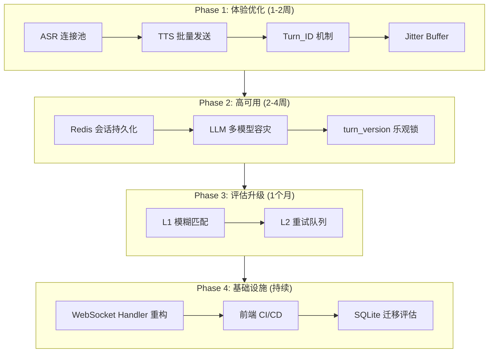

注：有些功能在无网络时启动会出问题，比如vad的加载。如果在启动时没有网络，则没有后续补救，现象就是开始说话按钮点不动。


# EnglishCoach 项目优化计划

> 生成日期: 2026-04-25
> 项目路径: `c:\dev\EnglishCoach_Project`

---

## 一、（✅）极致低延迟与流式体验 (Ultra-Low Latency)

### 1.1 ASR 连接池化预热 (🔴 高优先级)

| 项目 | 说明 |
|------|------|
| **位置** | `python_backend/core/audio_service.py` |
| **问题** | ASR 每次请求实时建立 WebSocket 连接，建连+SSL 握手耗时 100-300ms |
| **现状** | `TTSPool` 已做连接预热，但 ASR (`run_volcengine_wss_asr`, `run_volc_streaming_asr_worker`) 每次新建连接 |
| **建议方案** | 实现 ASR 连接池，预热 2-3 个连接，用户开口瞬间音频包直接 push |

**架构示意:**

```python
class ASRConnectionPool:
    def __init__(self, size=3):
        self.pool = [self._create_connection() for _ in range(size)]
        self.lock = asyncio.Lock()

    async def get_connection(self):
        async with self.lock:
            conn = await self.pool.pop()
            if not conn.is_alive():
                conn = await self._create_connection()
            return conn

    async def return_connection(self, conn):
        async with self.lock:
            self.pool.append(conn)
```

---

### 1.2 （❌）TTS Char-by-Char 延迟优化 (🔴 高优先级)（只针对火山TTS）

| 项目 | 说明 |
|------|------|
| **位置** | `python_backend/core/audio_service.py` (约 868-873 行) |
| **问题** | 每字符发送后 `asyncio.sleep(0.005)`，平均 200ms/句，延迟高 |
| **现状** | 5ms/字符 × 40 字符/句 = 200ms TTFT (Time to First Token) |
| **建议方案** | 批量发送，10-20 字符/批次 |

**优化前后对比:**

```python
# 优化前
for char in text:
    frame = make_tts_frame(char)
    await websocket.send_bytes(frame)
    await asyncio.sleep(0.005)

# 优化后 (伪代码)
chunk_size = 15  # 字符批次大小
for i in range(0, len(text), chunk_size):
    chunk = text[i:i + chunk_size]
    frame = make_tts_frame(chunk)
    await websocket.send_bytes(frame)
    await asyncio.sleep(0.05)  # 批次间隔
```

---

### 1.3 端侧音频抗抖动 Jitter Buffer (🟡 中优先级)

| 项目 | 说明 |
|------|------|
| **位置** | `flutter_frontend/lib/core/network/websocket_client.dart` 或 `chat_provider.dart` |
| **问题** | 弱网 (地铁、电梯) 环境下网络包到达不均匀，导致 TTS 播放出现"卡顿/碎音" |
| **现状** | 前端收到 PCM 字节流后直接塞入 `_player.uint8ListSink`，无缓冲 |
| **建议方案** | 引入自适应 Jitter Buffer，累积 50-100ms 音频包后再开始播放 |

```dart
class JitterBuffer {
  final List<Int8List> _buffer = [];
  final int _targetMs = 80;  // 目标缓冲 80ms

  void add(List<int> audioData) {
    _buffer.add(Int8List.fromList(audioData));
  }

  List<int>? drain() {
    if (_buffer.length < 3) return null;  // 至少累积 3 个包
    // 合并并清空缓冲
  }
}
```

---

### 1.4 彻底打断响应消除"幽灵语音" (🔴 高优先级)

| 项目 | 说明 |
|------|------|
| **位置** | `python_backend/api/websocket/coach_ws.py` + Flutter `chat_provider.dart` |
| **问题** | 打断后主 LLM 可能还在生成，网络缓冲区有残留，导致听到旧单词的"幽灵语音" |
| **现状** | 前端通过 `cancel_tts` 停止后端下发并关闭 player，但后端仅清空队列 |
| **建议方案** | 引入 **Turn_ID** 机制，所有音频包和文字流携带版本号，打断时废弃旧版本 |

**设计:**

```python
# 消息结构
{
    "type": "tts_audio",
    "turn_id": "session_123_turn_5",  # 对话轮次版本号
    "data": "...",
    "is_final": false
}

# 打断时前端发送
{"action": "interrupt", "turn_id": "session_123_turn_5"}

# 后端逻辑
if incoming_turn_id != current_active_turn_id:
    discard_packet()  # 丢弃过期包
```

---

### 1.5 （✅）后台预热时机前置 (🟡 中优先级)

| 项目 | 说明 |
|------|------|
| **位置** | `flutter_frontend/lib/features/chat/providers/chat_provider.dart` |
| **问题** | 目前在打开 ChatScreen 时才开始预热连接，有 500ms 延迟 |
| **现状** | `Future.delayed(500)` 开始预热 |
| **建议方案** | 用户停留在首页时就静默建立 WebSocket 连接并预热，点击"开始对话"直接零延迟进场 |

总结：当前已经是0.0.7且没有走下载途径（好像，因为修改下载的时候报错而修改前不报错）。现在是vad包在管理，它下载的模型是内存缓存，且我们没法拿到，所以没法持久化

改动总结

| 文件                    | 改动                                     |
| :---------------------- | :--------------------------------------- |
| `websocket_client.dart` | 添加 8 秒超时，抛出 `TimeoutException`   |
| `chat_provider.dart`    | 去掉 500ms 延迟 + 并行预热（防穿透结构） |

VAD 全流程耗时分析

| 阶段                   | 描述                                                         | 预计耗时             | 可优化             |
| :--------------------- | :----------------------------------------------------------- | :------------------- | :----------------- |
| 1. 模型下载            | 从 CDN (`https://cdn.jsdelivr.net/...`) 下载 `silero_vad.onnx` | 0.5-3s（取决于网络） | 是 - 打包到 assets |
| 2. 模型解析            | 读取 .onnx 文件，解析图结构、权重                            | 0.1-0.3s             | 部分 - 本地缓存    |
| 3. ONNX Runtime 初始化 | 加载 onnxruntime 库，初始化推理引擎                          | 0.3-0.5s             | 否 - 框架固有      |
| 4. 模型加载到内存      | 将模型权重拷贝到 GPU/CPU 内存                                | 0.1-0.3s             | 否 - 框架固有      |
| 5. 推理预热            | 首次推理需要 JIT 编译优化                                    | 0.1-0.2s             | 否 - 框架固有      |

VAD 不可用时的完整流程

| 场景             | 触发条件  | 结果                                  |
| :--------------- | :-------- | :------------------------------------ |
| 用户说话 → 停止  | 30 秒超时 | `stopListeningAndSubmit()` → 发往后端 |
| 用户不说话       | 30 秒超时 | `forceIdle()` → 退回等待状态          |
| 用户手动点击按钮 | 用户操作  | `stopListeningAndSubmit()`            |

所以

- 前端 VAD 只是"锦上添花" — 能在说话停止时立即触发
- 后端 ASR 是真正的兜底 — 无论前端何时发送，后端都能处理
- 30 秒超时是第二层兜底 — 确保不会无限等待

用户体验会稍差（需要等 30 秒才能自动发送，而不是说完就发），但功能是完整的。

---

## 二、高可用与商业级健壮性 (High Availability)

### 2.1 会话状态持久化 Redis (🔴 高优先级)

| 项目 | 说明 |
|------|------|
| **位置** | `python_backend/api/websocket/coach_ws.py` |
| **问题** | `session_ctx = SessionContext()` 是内存变量，网络闪断后对话直接重置到 ICE_BREAKING |
| **现状** | 用户进入电梯再出来，WebSocket 重连但 session_ctx 丢失 |
| **建议方案** | 将 session_ctx、session_hits 序列化缓存到 Redis，10 分钟窗口内断线重连直接恢复 |

**架构:**

```
Redis Key: session:{user_id}:{session_id}
TTL: 600s (10分钟)
Value: {
    "session_ctx": {...},
    "session_hits": [...],
    "phase": "CORE_TASK",
    "last_update": timestamp
}
```

```python
# 断线重连时
async def on_connect(websocket):
    user_id = websocket.user_id
    cached = await redis.get(f"session:{user_id}:current")
    if cached:
        session_ctx = deserialize(cached)
        logger.info("Restored session from Redis")
```

---

### 2.2 LLM 多模型容灾 (🔴 高优先级)

| 项目 | 说明 |
|------|------|
| **位置** | `python_backend/infrastructure/llm/client.py` |
| **问题** | 硬编码 `model="deepseek-chat"`，DeepSeek API 限流或宕机时 App 完全瘫痪 |
| **现状** | 无任何降级策略 |
| **建议方案** | 封装 LLM 路由，主模型超时/报错时秒级切换到备用模型 |

```python
class LLMRouter:
    def __init__(self):
        self.providers = [
            DeepSeekProvider(),
            AzureOpenAIProvider(),  # 备用
            ClaudeProvider(),       # 备用
        ]
        self.current = 0

    async def chat(self, messages):
        for i in range(len(self.providers)):
            try:
                return await self.providers[self.current].chat(messages)
            except (TimeoutError, RateLimitError) as e:
                logger.warning(f"Provider {self.current} failed: {e}")
                self.current = (self.current + 1) % len(self.providers)
        raise AllProvidersFailedError()
```

---

### 2.3 副模型竞态条件防护 - turn_version 乐观锁 (🟡 中优先级)

| 项目 | 说明 |
|------|------|
| **位置** | `python_backend/api/websocket/coach_ws.py` |
| **问题** | `_run_background_evaluator` 是后台异步的，用户语速快时副 LLM 结果可能推进错误轮次 |
| **现状** | 无版本控制 |
| **建议方案** | 引入 `turn_version`，只有匹配当前轮次时才修改状态机参数 |

```python
# 状态结构
session_ctx = {
    "turn_version": 5,  # 当前轮次版本
    "llm_wants_to_advance": False
}

# 副 LLM 返回时
async def on_evaluator_result(result, expected_version):
    if result.turn_version == session_ctx["turn_version"]:
        session_ctx.update(result)  # 安全更新
    else:
        logger.debug(f"Discard stale evaluator result v{result.turn_version} vs current v{session_ctx['turn_version']}")
```

---

### 2.4 SQLite 生产限制评估 (🟡 中优先级)

| 项目 | 说明 |
|------|------|
| **位置** | `python_backend/database.py` |
| **问题** | SQLite 单线程限制，不适合高并发生产环境 |
| **建议** | 评估 PostgreSQL 迁移方案，结合 Redis 用于会话缓存 |

---

## 三、教学与评估引擎升级 (Assessment Engine)

### 3.1 L1 评估发音容错 - 模糊匹配 (🟡 中优先级)

| 项目 | 说明 |
|------|------|
| **位置** | `python_backend/application/services/mastery_scorer.py` |
| **问题** | 精准字符串/词干匹配，ASR 口语化转录 (gonna, wanna) 导致 L1 算作未命中 |
| **现状** | `_l1_match_quality` 依赖精准匹配 |
| **建议方案** | 引入音素级模糊匹配或 Levenshtein 编辑距离阈值 |

```python
from difflib import SequenceMatcher

def fuzzy_match(user_text: str, target: str, threshold: float = 0.8) -> float:
    """基于编辑距离的模糊匹配"""
    ratio = SequenceMatcher(None, user_text, target).ratio()
    return ratio if ratio >= threshold else 0.0

def phonetic_match(user_text: str, target: str) -> bool:
    """音素级匹配 (需要安装 phonetics 库)"""
    return metaphone.compare(user_text, target)
```

---

### 3.2 L2 离线重试机制 (🟡 中优先级)

| 项目 | 说明 |
|------|------|
| **位置** | `python_backend/core/dialogue_engine.py` 或 `assessment_engine.py` |
| **问题** | L2 评估 20s 超时后跳过，不记录，导致 UserProgress 数据不准确 |
| **现状** | `asyncio.TimeoutError` 直接跳过 |
| **建议方案** | 失败任务写入后台任务表 (Celery/RQ)，系统空闲时补算 |

```python
from celery import Celery

celery_app = Celery('englishcoach')

@celery_app.task(bind=True, max_retries=3)
def retry_l2_evaluation(self, user_id: str, turn_data: dict):
    try:
        result = await l2_evaluate(turn_data)
        save_result(user_id, result)
    except Exception as e:
        self.retry(exc=e, countdown=60)  # 60秒后重试

# 原调用处
try:
    result = await l2_evaluate(turn_data)
except asyncio.TimeoutError:
    retry_l2_evaluation.delay(user_id, turn_data)  # 写入队列
```

---

### 3.3 VectorStore 增量更新 (🟡 中优先级)

| 项目 | 说明 |
|------|------|
| **位置** | `python_backend/infrastructure/vector_store/numpy_store.py:48` |
| **问题** | 每次 `add()` 调用重建整个矩阵，O(n) 复杂度 |
| **建议方案** | 增量添加 + 懒重建（累积 N 个操作后重建）|

---

## 四、可靠性与健壮性

### 4.1 API 输入验证 (🟡 中优先级)

| 位置 | 现状 |
|------|------|
| `python_backend/api/routes.py` | 缺少 Pydantic schema 验证 |
| `python_backend/api/websocket/coach_ws.py` | WebSocket 消息格式无校验 |

**建议:** 添加 Pydantic model 进行请求验证

```python
from pydantic import BaseModel, Field

class TopicRequest(BaseModel):
    category: str = Field(..., min_length=1, max_length=50)
    difficulty: int = Field(1, ge=1, le=5)

class TopicResponse(BaseModel):
    topic_id: str
    title: str
    description: str
```

---

### 4.2 限流机制 (🟡 中优先级)

| 端点 | 风险 |
|------|------|
| `/api/topics` | 频繁请求耗尽资源 |
| `/api/stats` | 数据聚合耗时 |
| `/ws/coach` | WebSocket 连接耗尽 |

**建议:** 使用 `slowapi` 或自定义中间件

```python
from slowapi import Limiter
from slowapi.util import get_remote_address

limiter = Limiter(key_func=get_remote_address)

@router.get("/api/topics")
@limiter.limit("30/minute")
async def get_topics(request: Request):
    ...
```

---

### 4.3 异常处理改进 (🟡 中优先级)

| 位置 | 问题 |
|------|------|
| `chat_provider.dart` | 多处 `catch (_) {}` 静默吞掉异常 |
| `websocket_client.dart` | 连接失败未记录详细错误 |
| `coach_ws.py` | 状态转换异常未处理 |

---

## 五、代码质量与可维护性

### 5.1 WebSocket Handler 重构 (🔴 高优先级)

| 项目 | 说明 |
|------|------|
| **位置** | `python_backend/api/websocket/coach_ws.py` |
| **问题** | 单个 handler 约 500 行，职责过重，难以维护 |
| **建议方案** | 拆分为子模块 |

**拆分建议:**

```
coach_ws.py
├── audio_handler.py      # 音频缓冲、ASR 触发、VAD 逻辑
├── message_router.py     # 消息类型路由、分发
├── state_manager.py      # SessionContext 状态管理、turn_version
├── tts_coordinator.py    # TTS 播放协调、turn_id 追踪
└── coach_ws.py           # WebSocket 入口、依赖组装
```

---

### 5.2 Flutter 异步状态初始化 (🟡 中优先级)

| 项目 | 说明 |
|------|------|
| **位置** | `flutter_frontend/lib/core/providers/settings_provider.dart` |
| **问题** | `build()` 中触发异步初始化但未 await |
| **建议方案** | 改用 `AsyncNotifier` |

---

### 5.3 硬编码配置值 (🟡 中优先级)

| 位置 | 硬编码值 |
|------|----------|
| `flutter_frontend/lib/core/network/backend_config.dart` | IP `172.20.10.4` |
| `flutter_frontend/lib/core/providers/settings_provider.dart` | Mastery 阈值 `88.0`, `75.0` |

---

### 5.4 WebSocket 连接超时 (🟡 中优先级)

| 项目 | 说明 |
|------|------|
| **位置** | `flutter_frontend/lib/core/network/websocket_client.dart` |
| **问题** | `connect()` 无超时，可能无限挂起 |
| **建议方案** | 添加 `connectionTimeout` 参数 |

---

### 5.5 VAD 模型资源管理 (🟡 中优先级)

| 项目 | 说明 |
|------|------|
| **位置** | `flutter_frontend/lib/core/vad/silero_vad_service.dart` |
| **问题** | App 退出时 VAD 模型未释放 |
| **建议方案** | 添加 `dispose()` 方法，在 App lifecycle 中调用 |

---

### 5.6 代码清理 (🟢 低优先级)

| 位置 | 问题 |
|------|------|
| `audio_service.py:411` | 死代码，`return` 语句重复 |
| 缺少类型注解 | 部分 Python 函数无 type hints |

---

### 5.7 日志轮转竞态修复 (🟢 低优先级)

| 项目 | 说明 |
|------|------|
| **位置** | `flutter_frontend/lib/core/logging/app_logger.dart` |
| **问题** | `rename()` 操作非原子，可能失败 |
| **建议** | 使用文件锁或追加+截断模式 |

---

## 六、DevOps & 部署优化

### 6.1 Docker 多阶段构建 (🟡 中优先级)

| 项目 | 说明 |
|------|------|
| **位置** | `python_backend/Dockerfile` |
| **现状** | 单阶段构建，镜像体积大 |
| **建议** | 分离构建依赖和运行时依赖 |

```dockerfile
# 多阶段构建示例
FROM python:3.10-slim AS builder
COPY requirements.txt .
RUN pip install --prefix=/install -r requirements.txt

FROM python:3.10-slim
COPY --from=builder /install /usr/local
COPY . /app
WORKDIR /app
RUN apt-get update && apt-get install -y ffmpeg && rm -rf /var/lib/apt/lists/*
CMD ["uvicorn", "server:app", "--host", "0.0.0.0", "--port", "8000"]
```

---

### 6.2 pip 缓存优化 (🟡 中优先级)

```dockerfile
RUN --mount=type=cache,target=/root/.cache/pip \
    pip install -r requirements.txt
```

---

### 6.3 前端 CI/CD 流程 (🟡 中优先级)

| 问题 | 现状 |
|------|------|
| Flutter 测试 | ❌ 无 |
| Flutter 分析 | ❌ 无 |
| 构建检查 | ❌ 无 |

**建议添加 `flutter-ci.yml`:**

```yaml
name: Flutter CI

on:
  push:
    paths:
      - 'flutter_frontend/**'
  pull_request:
    paths:
      - 'flutter_frontend/**'

jobs:
  analyze:
    runs-on: ubuntu-latest
    steps:
      - uses: actions/checkout@v4
      - uses: actions/setup-java@v4
        with:
          distribution: 'temurin'
          java-version: '17'
      - uses: subosito/flutter-action@v2
        with:
          flutter-version: '3.22.0'
          channel: 'stable'
      - run: flutter pub get
      - run: flutter analyze
      - run: flutter test

  build:
    needs: analyze
    runs-on: ubuntu-latest
    steps:
      - uses: actions/checkout@v4
      - uses: actions/setup-java@v4
        with:
          distribution: 'temurin'
          java-version: '17'
      - uses: subosito/flutter-action@v2
        with:
          flutter-version: '3.22.0'
          channel: 'stable'
      - run: flutter pub get
      - run: flutter build apk --release
      - uses: actions/upload-artifact@v4
        with:
          name: apk
          path: build/app/outputs/flutter-apk/app-release.apk
```

---

### 6.4 生产配置分离 (🟡 中优先级)

```yaml
# docker-compose.yml (开发)
# docker-compose.prod.yml (生产)
services:
  backend:
    deploy:
      resources:
        limits:
          cpus: '1'
          memory: 1G
        reservations:
          cpus: '0.5'
          memory: 512M
    environment:
      - LOG_LEVEL: info
      - WORKERS: 4
```

---

### 6.5 安全扫描 (🟢 低优先级)

```yaml
# 添加到 backend-tests.yml
- name: Security scan
  run: |
    docker run --rm -v $(pwd):/workspace aquasec/trivy:latest fs /workspace
```

---

## 七、优化优先级汇总

### 🔴 高优先级 (立即执行)

| # | 优化项 | 预计工时 | 收益 |
|---|--------|----------|------|
| 1 | **ASR 连接池化预热** | 4-6h | 降低 ASR 延迟 100-300ms |
| 2 | **TTS 批量发送优化** | 2-4h | 降低 TTFT 约 150ms |
| 3 | **Turn_ID 幽灵语音消除** | 4-6h | 消除打断后的"幽灵语音" |
| 4 | **Redis 会话持久化** | 6-8h | 断线重连无缝续聊 |
| 5 | **LLM 多模型容灾** | 4h | 核心对话链路永远不挂 |
| 6 | **WebSocket Handler 重构** | 1-2 天 | 提升可维护性 |

---

### 🟡 中优先级 (本月内)

| # | 优化项 | 预计工时 |
|---|--------|----------|
| 7 | Jitter Buffer 抗抖动 | 4h |
| 8 | turn_version 乐观锁 | 2h |
| 9 | L1 模糊匹配 (Levenshtein) | 4h |
| 10 | L2 离线重试队列 | 4h |
| 11 | 预热时机前置 (首页预热) | 2h |
| 12 | Flutter 异步状态初始化 | 2h |
| 13 | 异常处理改进 | 4h |
| 14 | API 输入验证 | 4h |
| 15 | 限流机制 | 4h |
| 16 | 硬编码配置值移除 | 4h |
| 17 | Docker 多阶段构建 | 2h |
| 18 | 前端 CI/CD 流程 | 4h |
| 19 | WebSocket 连接超时 | 1h |
| 20 | VAD 模型资源管理 | 1h |
| 21 | SQLite 迁移评估 | 1 天 |

---

### 🟢 低优先级 (技术债务)

| # | 优化项 | 预计工时 |
|---|--------|----------|
| 22 | 代码清理 (死代码、类型注解) | 2h |
| 23 | 日志轮转竞态修复 | 2h |
| 24 | 生产配置分离 | 2h |
| 25 | 安全扫描集成 | 2h |

---

## 八、架构演进路线图



---

## 九、附录

### A. 相关文件路径

```
EnglishCoach_Project/
├── python_backend/
│   ├── server.py                          # FastAPI 入口
│   ├── database.py                        # 数据库模型
│   ├── core/
│   │   ├── audio_service.py              # ASR/TTS 服务
│   │   ├── dialogue_engine.py            # 对话引擎
│   │   └── telemetry.py                  # 遥测
│   ├── api/
│   │   ├── http/routes.py                # REST 路由
│   │   └── websocket/coach_ws.py         # WebSocket 处理
│   ├── infrastructure/
│   │   ├── llm/client.py                 # LLM 客户端
│   │   └── vector_store/numpy_store.py   # 向量存储
│   └── application/services/
│       ├── session_planner.py             # LMS 规划器
│       └── mastery_scorer.py             # 掌握度评分
├── flutter_frontend/lib/
│   ├── core/
│   │   ├── vad/silero_vad_service.dart   # VAD 服务
│   │   ├── network/websocket_client.dart  # WebSocket 客户端
│   │   ├── logging/app_logger.dart        # 日志
│   │   └── providers/settings_provider.dart  # 设置
│   └── features/chat/providers/
│       └── chat_provider.dart            # 聊天状态
├── docker-compose.yml
├── Dockerfile
└── .github/workflows/
    ├── deploy.yml                        # 部署工作流
    └── backend-tests.yml                 # 测试工作流
```

### B. 新增依赖

| 依赖 | 用途 |
|------|------|
| `redis` | 会话状态持久化 |
| `phonetics` | 音素级模糊匹配 |
| `celery` / `rq` | L2 离线重试队列 |
| `slowapi` | API 限流 |
| `deepdiff` | 模糊匹配算法 |

### C. 相关文档

- [项目 README](README.md)
- [后端测试工作流](.github/workflows/backend-tests.yml)
- [部署工作流](.github/workflows/depoly.yml)


